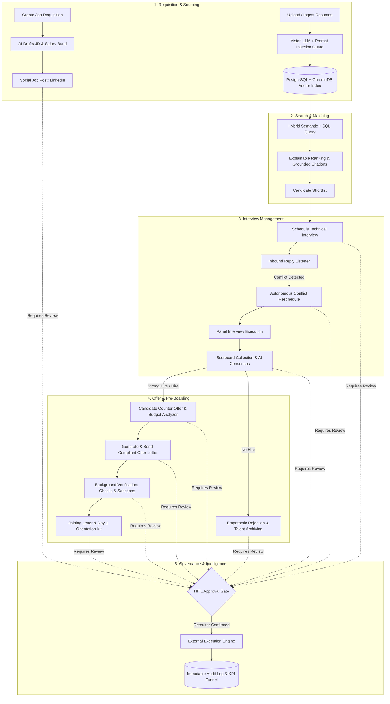
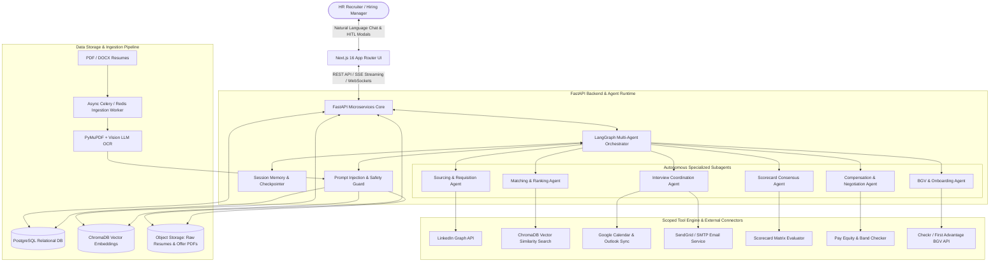
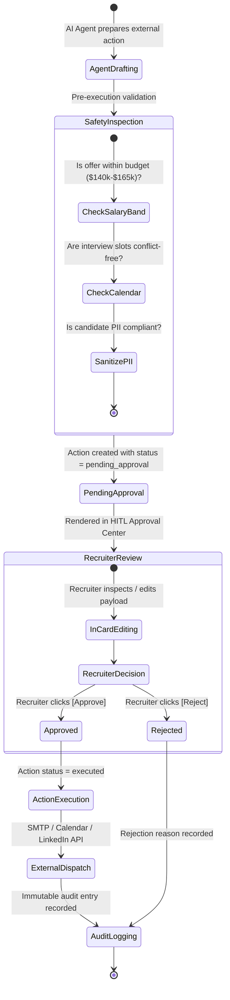
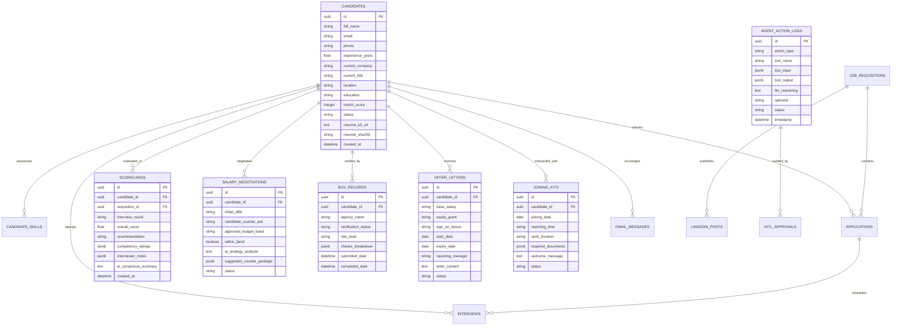

# Master Architecture & Implementation Plan: TalentPulse AI

## Autonomous Enterprise HR Recruitment, Pipeline Management & Candidate Lifecycle Assistant

> **Project Vision**: An enterprise-grade, autonomous AI HR Recruiter and Talent Acquisition Platform. The system orchestrates the entire recruiting lifecycle—from job requisition generation and multi-modal resume parsing to hybrid semantic search, automated calendar conflict resolution, panel scorecard synthesis, counter-offer salary negotiation, compliant offer letter dispatch, background verification (BGV), and onboarding welcome kits. All state-changing and external operations are strictly governed by **Human-In-The-Loop (HITL)** approval gates and immutable audit logging.

---

## 1. Problem Statement & Enterprise Value Proposition

### 1.1 The Problem in Modern Recruitment

Modern talent acquisition workflows are fragmented across multiple disconnected systems (ATS, job boards, email inboxes, calendar tools, background check agencies, document signature portals, and spreadsheets).

- **Recruiter Burnout & Bottlenecks**: Up to 65% of recruiter time is consumed by manual tasks—formatting job posts, parsing messy multi-column PDFs, emailing candidates back and forth for reschedule slots, tallying interviewer scorecards, and computing salary counter-offers.
- **Slow Time-to-Hire**: Traditional enterprise hiring takes 36 to 48 days on average, leading to high candidate drop-off rates and lost top-tier talent.
- **Compliance & Bias Hazards**: Manual compensation offers often violate internal pay parity bands or equal pay regulations, while ungrounded resume screening risks demographic bias and security vulnerabilities like resume prompt injection.

### 1.2 The TalentPulse AI Solution

TalentPulse AI introduces an autonomous multi-agent recruitment architecture backed by LangGraph and FastAPI, seamlessly integrated with a modern Next.js enterprise UI:

1. **100% Lifecycle Automation**: Operates from initial Job Requisition to Day 1 Welcome Kit dispatch.
2. **Strict Human-in-the-Loop (HITL) Governance**: The AI agent drafts and proposes actions with full explainability, but **never executes destructive or external actions** (sending emails, posting publicly, dispatching binding offer letters) without explicit recruiter authorization.
3. **Grounded Attribution**: Every match score and skill recommendation includes exact citations referencing source resume sections, eliminating hallucinations.
4. **Adversarial & Injection Defense**: Untrusted candidate resumes are sanitized through a multi-modal parser and prompt injection firewall before LLM reasoning.

---

## 2. End-to-End Recruitment Lifecycle & Workflow



---

## 3. Detailed System Architecture



---

## 4. Multi-Agent System Roles & Responsibilities

| Agent Persona                           | Primary Function                                                                                                    | Primary Tools Used                                                               |              HITL Gate Trigger              |
| :-------------------------------------- | :------------------------------------------------------------------------------------------------------------------ | :------------------------------------------------------------------------------- | :-----------------------------------------: |
| **1. Sourcing & Requisition Agent**     | Generates compliant JDs, extracts skill matrices, creates and publishes social job posts.                           | `draft_linkedin_job_post`, `publish_linkedin_job_post`, `create_job_requisition` |    **Yes** (Before publishing live post)    |
| **2. Ingestion & Sanitization Agent**   | Extracts structured text from multi-column PDFs, verifies PII, neutralizes prompt injections, computes embeddings.  | `parse_resume_multimodal`, `sanitize_input_text`, `index_vector_embeddings`      |         No (Automated async worker)         |
| **3. Matching & Search Agent**          | Performs hybrid SQL + vector queries, ranks candidates against role criteria, provides grounded citations.          | `search_candidates_hybrid`, `filter_active_pipeline`, `get_grounded_citations`   |          No (Read-only analytics)           |
| **4. Interview Coordination Agent**     | Books interview rounds, monitors candidate inbound replies, detects calendar conflicts, and negotiates reschedules. | `schedule_interview_slot`, `reschedule_interview_slot`, `parse_inbound_reply`    |  **Yes** (Before sending invites/updates)   |
| **5. Scorecard Consensus Agent**        | Aggregates panel feedback, analyzes competencies, generates AI consensus debrief and hiring recommendation.         | `compile_interview_scorecard`, `evaluate_competency_matrix`                      |    **Yes** (Before advancing candidate)     |
| **6. Compensation & Negotiation Agent** | Evaluates candidate counter-offers against approved budget bands, recommends parity-compliant packages.             | `analyze_counter_offer`, `check_pay_equity_band`, `generate_counter_package`     |   **Yes** (Before sending revised terms)    |
| **7. Offer & Onboarding Agent**         | Formulates binding offer letters, tracks third-party background checks, and dispatches Day 1 welcome packages.      | `generate_offer_letter`, `initiate_bgv_check`, `dispatch_joining_kit`            | **Yes** (Before legally binding dispatches) |

---

## 5. Human-in-the-Loop (HITL) State Machine



---

## 6. Relational Database Schema (PostgreSQL)



---

## 7. Backend API Specification (FastAPI Microservices)

### 7.1 Agent & Conversational Endpoints

- `POST /api/v1/chat/message`: Send user prompt, triggers LangGraph multi-agent loop with streaming SSE response (`text/event-stream`).
- `GET /api/v1/chat/history`: Fetch active conversation trajectory and tool step logs.
- `POST /api/v1/chat/reset`: Initialize a clean agent session state.

### 7.2 Candidate & Pipeline Endpoints

- `POST /api/v1/candidates/upload`: Multi-part resume upload (PDF/DOCX), triggers async OCR & vector ingestion.
- `GET /api/v1/candidates`: List candidates with hybrid filters (skills, experience, stage, match score).
- `GET /api/v1/candidates/{id}`: Detailed candidate profile with grounded citation evidence.
- `PATCH /api/v1/candidates/{id}/status`: Transition candidate stage in the pipeline.
- `DELETE /api/v1/candidates/{id}/purge`: GDPR Right to Erasure (synchronous purge from SQL, Vector DB, and S3).

### 7.3 Human-in-the-Loop (HITL) Action Endpoints

- `GET /api/v1/hitl/actions`: List all actions by filter (`pending_approval`, `executed`, `rejected`).
- `POST /api/v1/hitl/actions/{id}/approve`: Recruiter authorizes action execution with optional payload modifications.
- `POST /api/v1/hitl/actions/{id}/reject`: Recruiter cancels action with recorded justification.

### 7.4 Specialized Lifecycle Endpoints

- `POST /api/v1/requisitions`: Create new role requisition and trigger JD generation.
- `POST /api/v1/scorecards/debrief`: Compile interviewer ratings into AI consensus report.
- `POST /api/v1/compensation/negotiate`: Analyze candidate counter-ask against department band.
- `POST /api/v1/offers/generate`: Generate formal offer letter PDF with e-sign placeholders.
- `GET /api/v1/bgv/status/{candidate_id}`: Query background verification clearance status.
- `POST /api/v1/onboarding/welcome-kit`: Dispatch Day 1 onboarding packet.
- `GET /api/v1/analytics/funnel`: Query live pipeline conversion rates, time-to-hire, and sourcing ROI.

---

## 8. Backend Implementation Roadmap

```
Sprint 1: Core LangGraph Agent Loop & FastAPI Foundation
          │
          ▼
Sprint 2: Async Multi-Modal Resume Ingestion & ChromaDB Vector Store
          │
          ▼
Sprint 3: HITL Action Center & Scoped MCP Tools (Email, Calendar, LinkedIn)
          │
          ▼
Sprint 4: Scorecard Synthesis, Compensation Analyzer & Offer Letter Generator
          │
          ▼
Sprint 5: Background Verification (BGV), Onboarding Kits & Inbound Email Webhook
          │
          ▼
Sprint 6: Enterprise Security, Prompt Injection Firewalls, Audit Logs & E2E Evals
```

### Sprint 1: Agentic Orchestration & Core Models

- [ ] Initialize FastAPI project with async SQLAlchemy, Alembic migrations, and PostgreSQL.
- [ ] Implement LangGraph state machine orchestrator with tool-calling ReAct loops.
- [ ] Setup SSE streaming response protocol for real-time token delivery to frontend.

### Sprint 2: Multi-Modal Ingestion & Hybrid Search

- [ ] Build Celery/Redis worker for processing uploaded PDF/DOCX resumes.
- [ ] Implement Vision LLM OCR and PyMuPDF text extraction.
- [ ] Implement ChromaDB dense vector indexing and hybrid PostgreSQL search algorithm.
- [ ] Add grounded citation generator linking match scores to source resume line numbers.

### Sprint 3: HITL Engine & Communication Tools

- [ ] Implement pending action state machine (`pending_approval`, `approved`, `rejected`, `executed`).
- [ ] Connect SMTP/SendGrid client for candidate emails with tracking pixels.
- [ ] Connect Google Calendar API for automated interview scheduling and conflict resolution.
- [ ] Connect LinkedIn API client for job requisition social posts.

### Sprint 4: Advanced HR Decision Modules

- [ ] Build `compile_interview_scorecard` agent tool for multi-interviewer score aggregation.
- [ ] Build `analyze_counter_offer` tool for salary negotiation and equity mix modeling.
- [ ] Build `generate_offer_letter` tool with salary band compliance enforcement ($140k-$165k).

### Sprint 5: Verification & Onboarding Automation

- [ ] Implement `initiate_bgv_check` tool with mock/live Checkr integration.
- [ ] Build `dispatch_joining_kit` tool with Day 1 KYC document checklist.
- [ ] Setup inbound email webhook listener with LLM sentiment & intent classification.

### Sprint 6: Security, Compliance & Evaluation Benchmark

- [ ] Build prompt injection barrier to isolate untrusted candidate resume payloads.
- [ ] Build GDPR Right-to-Erasure synchronous purge endpoint.
- [ ] Construct automated evaluation test suite (25 recruiting scenarios) measuring:
  - **Retrieval Precision@5**: $\ge 90\%$
  - **Hallucination Rate**: $0.0\%$ (All claims grounded in citations)
  - **HITL Interception**: $100.0\%$ (Zero autonomous external dispatch)
  - **Streaming First-Token Latency**: $< 600\text{ms}$
